### Summary Figure

### Introduction

#### Background
The death toll of the 2019 coronavirus disease (CoViD-19) has reached above 200,000 just in the U.S. CoViD-19 has been shown to affect various demographics of population differently. Certain factors like age and pre-existing health conditions have an impact on mortality outcome in CoViD-19 patients. People are not aware of their likelihood of death upon contraction of CoViD-19 and don’t have much information on which risk factors and predispositions negatively impact outcomes. The goal is to create a ML model which would predict the chance/risk of someone dying from CoViD-19 given biological factors and pre-existing diseases in order to increase awareness and responsibility for one's well-being in this crisis.

#### Dataset
To complete our project, we will primarily use datasets from Kaggle and the CDC containing information about reported CoViD-19 deaths. Ideally, our dataset will consist of data points (rows) that represent a state, where the columns are the features (such as age, gender, other health risk factors) with a label that represents the cause of death for that person with CoViD-19. With the dataset also having labels that describe the amount of patients that survived CoViD with these factors, we could use this data as our ground truth when examining our unsupervised algorithm.  Though there are some data points with empty columns (unknown race, unknown pre-existing disease), with 6.5k rows of data points, we believe that we have more than enough data for our algorithm. After a dataset cleanup with data that is provided on a weekly basis, whereas there are no empty datasets, the accuracy in the prediction of death chance determined by the factors will significantly increase. 

### Methods

Given our chosen data sets, we will identify the most relevant features contributing to each individual CoViD-19 death, and how these deaths correlate to said features. This data will then be used to make a prediction model using unsupervised clustering and supervised neural network techniques in order to predict how at-risk a certain individual or population may be, given data about said individual or population. To process our data sets, we have a few basic methods in mind:

#### Unsupervised Learning: Clustering
In order to get a better picture of which pre-existing health factors contribute most to the probability of a CoViD-19 fatality, we plan on implementing a clustering method such as KMeans. When run given our chosen data sets, the output of this KMeans algorithm will ideally group CoViD-19 deaths by the co-occurrence of similar factors into n-dimensional groups, identifying pre-existing conditions that, when combined, increase the risk of death from CoViD-19.

#### Supervised Learning: Neural Network
To get a more specific picture of the exact risk of death from CoViD-19 to a given individual, we will implement a form of neural network trained from our data sets. We will provide ground-truth data regarding whether CoVid-19 infected patients died as a result of their infection or another cause. This data will also encompass features regarding health data of each patient. The goal of this training is to obtain a network that will accept a variety of health information about a patient, and return a probability of said individual succumbing to a CoViD-19 infection, as well as conditions that may significantly increase their risk of a CoViD-19 fatality.

Both of these algorithms will have the flexibility to be able to be run over multiple different datasets containing different sets of factors and information, in order to better refine the models that can be used to predict the risk of death from CoViD-19.

### Results

Pre-existing data shows early trends in how certain conditions may increase the risk of death from CoVid-19. However, there is limited concrete understanding of exactly which individual conditions contribute most to this risk, and even less information about how having a multitude of conditions will affect risk. By taking into account a wide range of data that encompasses not just health conditions, but also environmental and genetic factors, and using it to predict the likelihood of future deaths, we hope to reveal more detail about risk factors and further enlighten the population on what groups are at risk using data they can see and understand. We expect at least 95% accuracy to predict mortality probability for patients with CoViD-19. To evaluate how effective our algorithms perform, we will use recall and precision metrics and expect scores of > 0.9. 
 
### Discussion

It is easy to ignore risk when risk is not well understood. Our goal is to present the general population with data that is easy to understand, digest, and interpret that provides a clear picture of how at-risk they may be from a CoVid-19 infection. When faced with the issue of deciding when to re-open our economies and the risk of “second wave” increases in infections, we want to do our best to ensure everyone is fully informed on how an infection may affect them personally. This is done in order to identify the most at-risk groups and to reiterate the importance of social distancing and mask wearing in order to prevent the spread of CoViD-19 to these groups.

### References

*   https://www.cdc.gov/nchs/nvss/vsrr/covid19/health_disparities.htm

*   https://towardsdatascience.com/predicting-mortality-in-the-icu-2e4832cc94d2

*   https://data.cdc.gov/NCHS/Deaths-involving-coronavirus-disease-2019-CoViD-19/ks3g-spdg

*   https://www.cdc.gov/coronavirus/2019-ncov/CoViD-data/investigations-discovery/assessing-risk-factors.html

*   https://www.news-medical.net/news/20200927/Risk-factors-for-mortality-among-hospitalized-patients-with-CoViD-19.aspx

*   https://ourworldindata.org/mortality-risk-CoViD

## ---

### Midterm Report

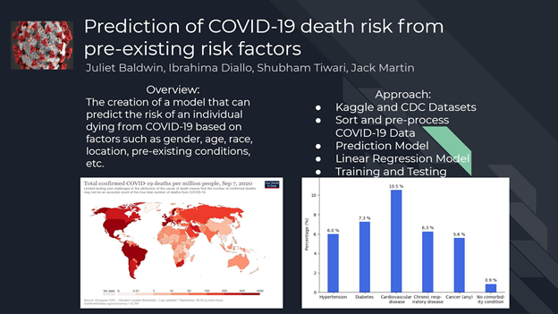

### Progress Highlights

#### Dataset
For our project, we used a public dataset from a CDC database containing CoViD-19 case surveillance information. Each data point represents a deidentified patient and includes their age, sex, presence of comorbidity, hospitalization status, etc. as well as binary class data on death outcome, which can be used as ground-truth label for some algorithms. Though there are some data points with empty columns (unknown race, unknown pre-existing disease), the raw dataset has over five million points and 11 features. Over the course of our project thus far, we have taken steps to clean, standardize, and run unsupervised learning algorithms on our data in order to better understand how these risk factors contribute to the likelihood that a patient who has contracted CoViD-19 will die. Our dataset did not seem to contain any outliers.

#### Data Cleaning and Standardization
With our data set only containing 11 features to begin with, data cleaning was fairly straightforward given visual analysis and modification through Python code. We determined that features involving dates, such as CDC report dates and symptom onset dates, were discarded as it is easy to understand that the day an individual contracts CoViD-19 does not contribute to their risk of death. Based on this assumption, we decided to cut the number of features down to six by removing these unwanted features.

Similarly, because we only wanted to look at data on confirmed cases of CoViD-19, we removed data points marked with the label ‘probable case’, as we only wanted to look at data marked ‘lab-confirmed case’. Finally, rows containing values of ‘missing’, ‘NA’, or ‘unknown’ in regard to any feature were also completely eliminated from the set. 

After the stages of cutting out data, we were left with a sizable 596807 data points to run our algorithms on. Before running these algorithms, however, it was imperative to standardize our data. Many of our remaining features were entirely categorical, making it impossible to run many unsupervised learning algorithms. To solve this issue, we wrote Python code to encode these categorical features as integers indicating ‘0’ as false and ‘1’ as true in some cases, or by using a range of integers based on the number of possible labels for a given feature.

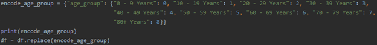

_Above: Example Code Used to Perform Integer Encoding of Categorical Features_

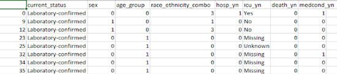

_Above: Example of Cleaned and Encoded Data_

#### Identifying Important Features
After cleaning and standardizing our data set, the next crucial step is identifying which features contribute to the majority of the variance in the data, and which can be discarded as irrelevant. This can be done in one of two ways. First, in datasets with high dimensionality, Principal Component Analysis, or PCA, can be used to empirically determine which features are most important. In cases of low dimensionality, such as our dataset that contains only six features after data cleaning, a more qualitative method can be employed. In our case, we were able to determine that, based on the goal of our project, all but one of the remaining features were crucial in order to get a complete understanding of how each contributes to the likelihood of a CoViD-19 fatality. Because we had removed data points labeled ‘probable case,’ this only left one type of data remaining for this feature. This means that this feature would not at all contribute to variance in our data and, for this reason, we decided to continue by running our unsupervised learning algorithms on the remaining five features.

#### Unsupervised Learning: Kmode Clustering
In order to understand which of the categorical pre-existing health factors contribute most to the probability of a CoViD-19 fatality, we decided to implement the K-Modes clustering algorithm as our unsupervised learning technique. When run on our chosen data sets, the output of this K-Modes algorithm is expected to, ideally, group CoViD-19 deaths data points by the co-occurrence of similar factors into various n-dimensional groups, identifying pre-existing risk factors that, when combined, contribute to an increase the risk of death from CoViD-19.

The first step in this process is to identify the optimal number of clusters to use in our K-Modes cluster predictions. To do this, we decided to implement the elbow method in order to determine this optimal number of clusters using a range of values for k between 1 and 25. Then, for each value of k, we computed an average score for all clusters, which in our cases represents the distortion cost. By default, the distortion cost is computed as the sum of square distances from each point to its assigned cluster center.

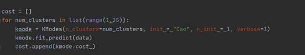

_Above: Code Used to Determine Clustering Cost_

A plot of our elbow method will then be created in order to have a better visual understanding of what the optimal number of clusters should be. This number is chosen based on a quick analysis to time a value of k after which cost reduction does not decrease dramatically, located at the “elbow” of the plot.

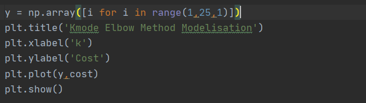

_Above: Code Used to Create Our Elbow Plot_

We then computed the cost given an increasing number of cluster centers and predicted the cluster index for each sample by minimizing a dissimilarity measure, whereas k modes count the number of “features” that are not the same. 

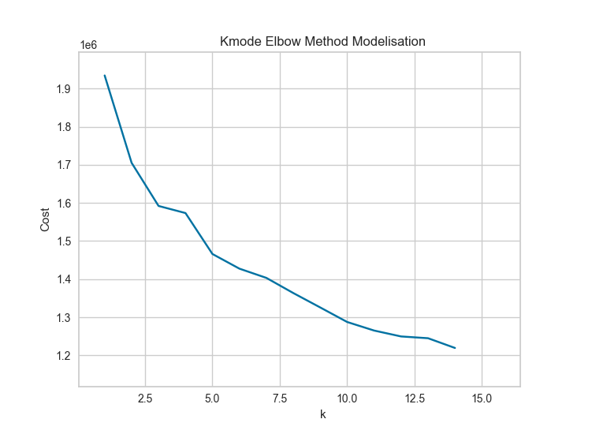

_Above: (25 Clusters)_

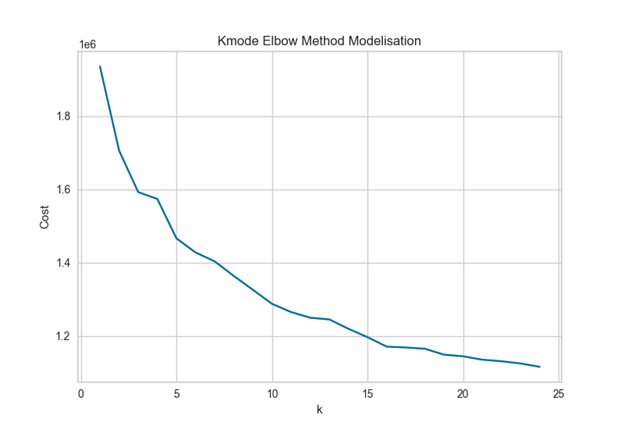

_Above: (15 clusters)_

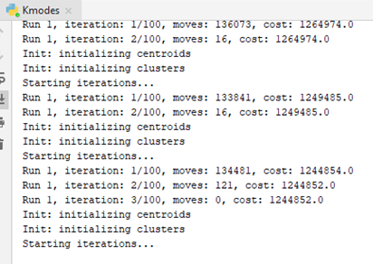

_Above: Example of Terminal Output_

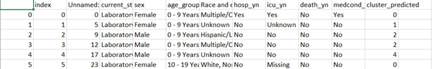

_Above: Example of Starting Data With Predicted Cluster from K-Modes_

The elbow-method graphed results above show that the optimal number of clusters for our dataset appears at about 5 clusters, exemplified by the sharp plateau at k=5 in our 15 and 25 cluster runs. While costs do decrease beyond this point, such diseases are trivial compared to the significant and sharp increase in the amount of time it takes to run our implementation of the K-Modes algorithm. For each iteration, the amount of moves needed decreases, though the cost stays mostly stagnant, changing by very little if at all, with the approximate range being about 1,000,000 - 2,000,000.

Our results clearly show not only that we can group our data into clusters based on these features, but also that the optimal number of clusters for grouping is k=5. With this in mind, we are able to run the K-Modes algorithm and visualize our results:

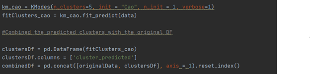

_Above: Code Used to Run K-Modes with k=5_

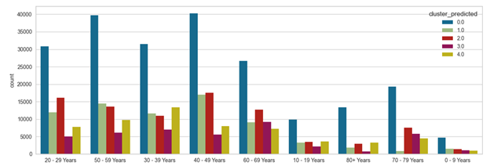

_Above: Bar Chart on Age-Group with an Optimal 5 Clusters_

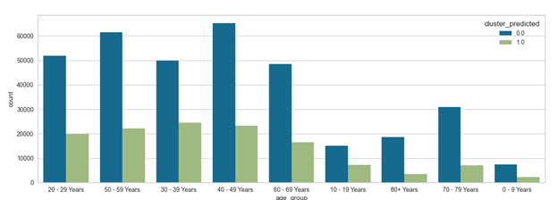

_Above: Example, Another Bar Chart on Age-Group with only 2 Clusters_

We can view our data based on certain features and their data counts (shown by the bar graph above). For our visualizations, we used age-range as our clustering basis, comparing the count of data points in each cluster for each age range. Beyond just showing that ages 40-59 have the highest count of cases, our clusters also indicate grouping by other categorical features that could contribute to risk of CoViD-19 death. In both bar charts, cluster 0 represents data points that were clustered by the co-occurrence of ICU hospitalization and the existence of pre-existing health conditions. Because of this, our K-Modes algorithm indicates higher counts of CoViD-19 death in every age range for this cluster. Qualitatively, this means that these factors contribute significantly to the probability that an individual will succumb to a case of CoViD-19.

Empirically, our K-Modes defines clusters using the amount of matching categories between data points. For example, take clusters 2 and 3 in the above example run with 5 total clusters. For the mode of each cluster, if a data point has a given categorical feature, the mode vector K consists of x categorical values for which each is the mode of a feature. For our data, the mode of an attribute can be “1” or “0” for category features that can be defined as true or false, and from 0-8 for features like age group and race/ethnicity. The mode becomes whichever number is most common in the cluster. The total number of labels that appeared on each predicted index cluster can be seen through the visualization above for the age group feature. From observation, it can be seen that the cluster at index 0 seemed to have the largest number of datasets, making it seem to have a unique constraint to its index, and thus indicating that tease features contribute most to the likelihood of a CoViD-19 death.

### Current Challenges and Next Steps
For this report, the current challenges our group has encountered so far are as follows: in cleaning and standardizing our data, we had to remove some data points that had too many missing or unknowns, which left only a small chunk of the original data left. However, because we started with so many data points to begin with, around 4.5 million, the loss is mostly negligible, leaving us with about 500k points with encoding and cleaning. Our K-Modes implementation runs without error, and our current challenge primarily lies in creating proper visualizations of the data in graph form by category. We tried different implementations and have settled on K-Modes, as so far this has provided us the best visual representations of our clustering, and works well with categorical data. We also have started on a supervised technique, binary logistic regression, because we have these many categorical independent variables and only two possible outcomes.

### References:

*   https://data.cdc.gov/Case-Surveillance/COVID-19-Case-Surveillance-Public-Use-Data/vbim-akqf 

*   https://medium.com/@davidmasse8/unsupervised-learning-for-categorical-data-dd7e497033ae 

*   https://pypi.org/project/kmodes/

*   https://www.researchgate.net/post/K_modes_clustering_how_to_choose_the_number_of_clusters

